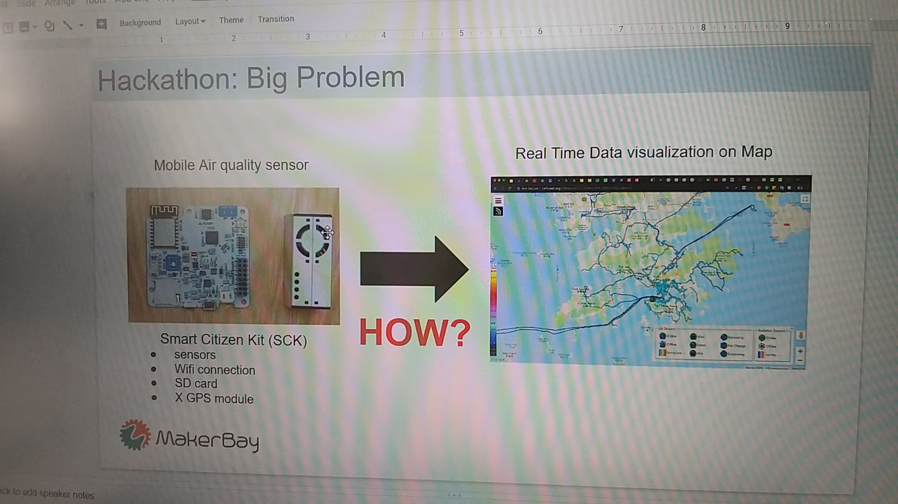
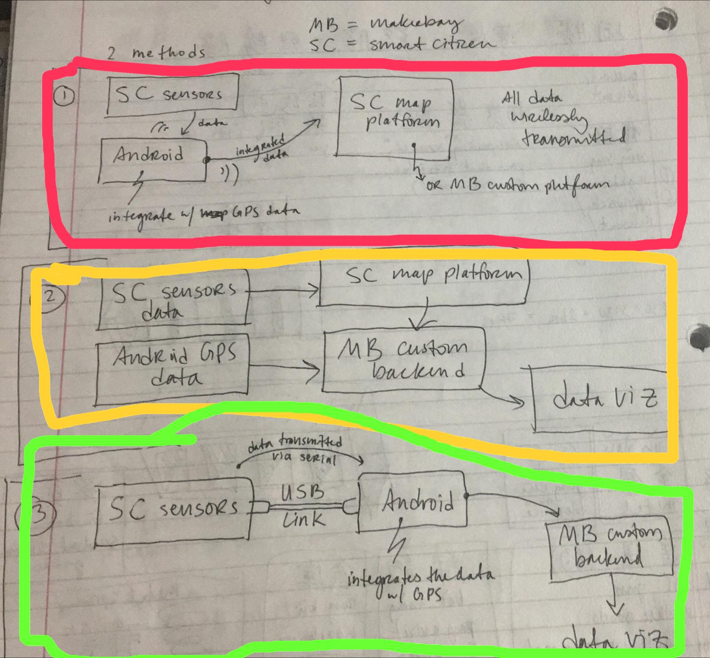

# Mobile-Air-Quality-Sensor-Vizualization

Technology:
[Smart Citizen Kit](https://smartcitizen.me/)
[Leaflet](https://leafletjs.com/)
[jQuery](https://jquery.com/)
Server with PHP and MySql database

References:
[(very good) Tutorial about accessing a Database with Leaflet](https://www.syncfusion.com/ebooks/leafletjs/accessing-external-data-sources)
[Marine_Litter_Detective github repo](https://github.com/MakerBay/Marine_Litter_Detective)
[Marine Litter Detective Website](http://marinelitterdetective.net/)
[Roadside Air Quality Index - NO2 (Nitrogen Dioxide) Website](http://makerbench.org/air/)

First step: by using divide and counquer we found our tasks: 
* Python script to get data from Smart platform
* get GPS data from Android
* Combine both data
* Vizualize data on a map

Decisions:

Accesing database directly from vizualization because its clean. The approch from the marine litter tool postet on github has .gpx files that are visualized.

We are using idea #2 after finding pros(+) and cons(-)

#1
-cyberattack on our own android -> No go

#2
+Using Software that’s already done
+We (Lauren) has these skills 

#3
-to many unknowns regarding our skills
